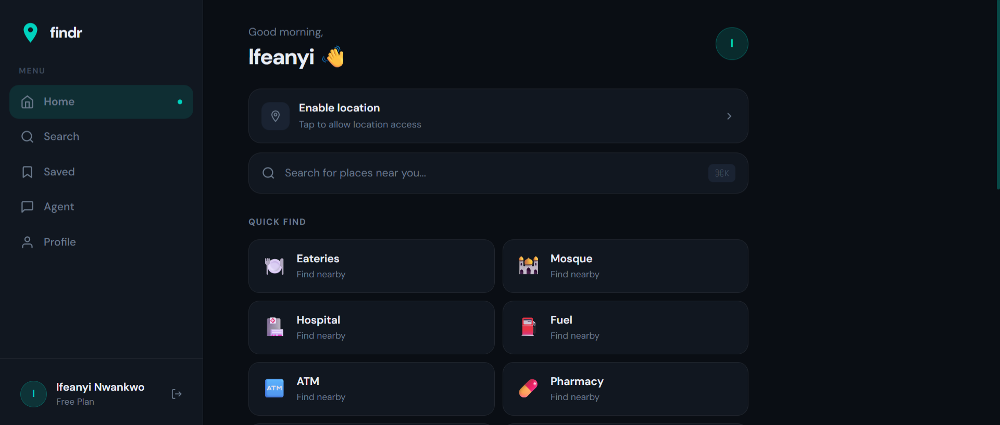
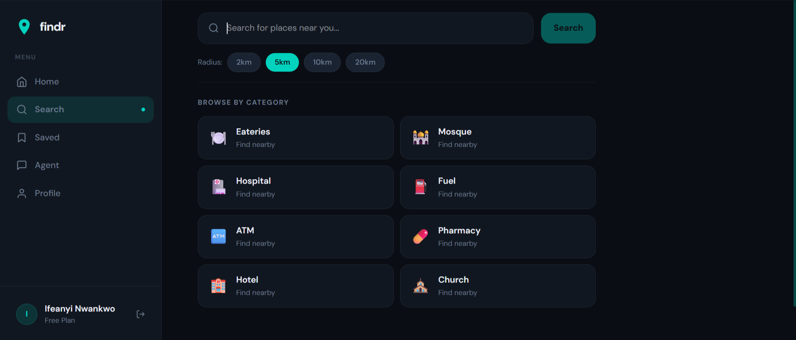
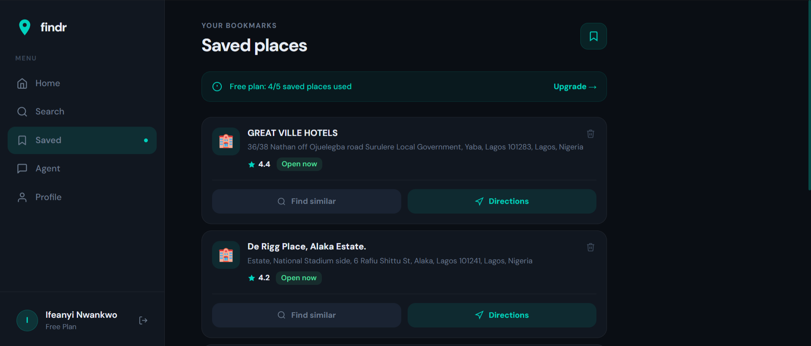
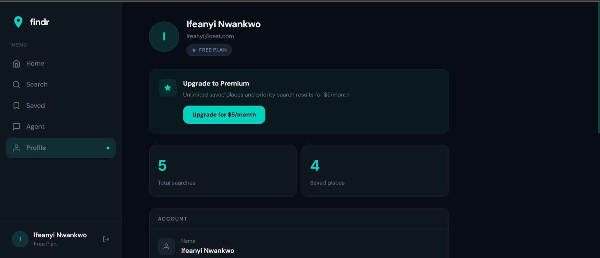
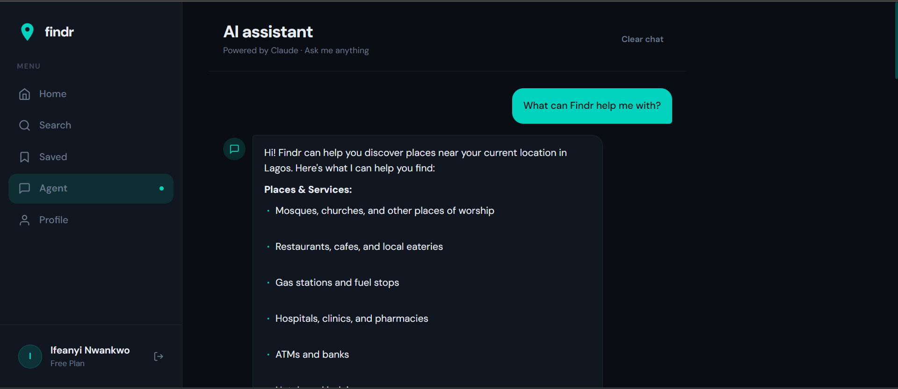
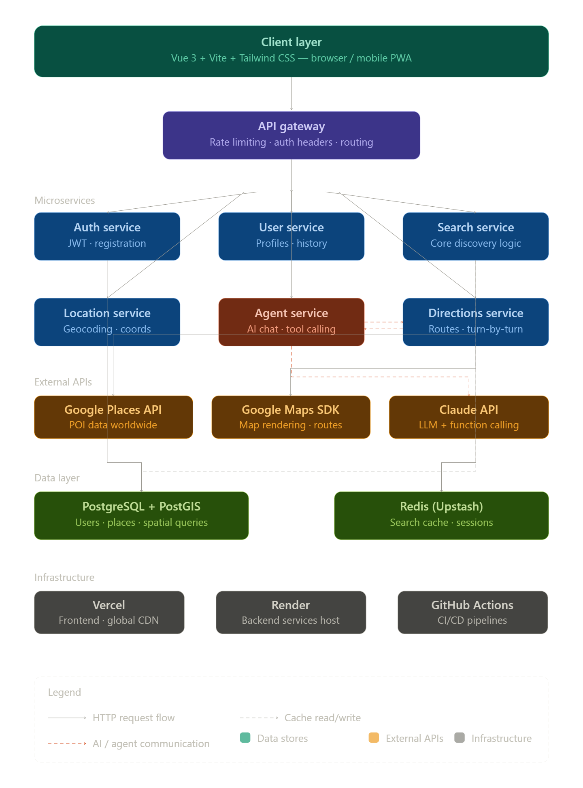

# Findr

> A location-based place discovery app powered by AI — find mosques, hospitals, ATMs, eateries and more near you, anywhere in the world.

**Live:** [findr-self.vercel.app](https://findr-self.vercel.app)

---

## Screenshots

<table>
  <tr>
    <td></td>
    <td></td>
  </tr>
  <tr>
    <td></td>
    <td></td>
  </tr>
</table>



---

## System Architecture



The architecture is split into four layers:

- **Client layer** — Vue 3 SPA served from Vercel's global CDN
- **API gateway** — Express with rate limiting, JWT auth headers and route delegation
- **Service layer** — Auth, Search, Places, Agent and Directions modules
- **Data layer** — PostgreSQL + PostGIS for spatial queries, Redis Cloud for search cache and agent sessions

---

## Tech Stack

### Frontend
| Technology      | Purpose                      |
| --------------- | ---------------------------- |
| Vue 3 + Vite    | SPA framework and build tool |
| Tailwind CSS v4 | Utility-first styling        |
| Pinia           | State management             |
| Vue Router      | Client-side routing          |
| Axios           | HTTP client                  |

### Backend
| Technology              | Purpose                                       |
| ----------------------- | --------------------------------------------- |
| Node.js + Express       | REST API server                               |
| PostgreSQL + PostGIS    | Spatial database for place and user data      |
| Redis Cloud             | Search result cache and agent session storage |
| Claude API (Anthropic)  | AI assistant with tool calling                |
| Google Places API (New) | Place discovery worldwide                     |
| Google Maps API         | Turn-by-turn directions                       |

### Infrastructure
| Service        | Role                                   |
| -------------- | -------------------------------------- |
| Vercel         | Frontend hosting, global CDN           |
| Render         | Backend hosting (staging + production) |
| Neon           | Managed PostgreSQL with PostGIS        |
| GitHub Actions | CI/CD pipelines                        |

---

## Features

- **Location-based search** — Find any type of place within a configurable radius using PostGIS spatial queries
- **AI assistant** — Conversational agent powered by Claude with tool calling — ask in natural language and it finds places for you
- **Smart caching** — Redis caches search results for 10 minutes, PostGIS serves repeat searches instantly without hitting Google
- **Directions** — Real Google Directions API integration with turn-by-turn steps and a direct "Open in Google Maps" link
- **Save places** — Bookmark places with notes, free plan supports up to 5 saved places
- **Search history** — Every search is stored and surfaced on the home screen
- **JWT authentication** — Secure registration and login with 7-day token expiry and Redis-based token blacklist on logout
- **Free / Premium plans** — Plan-based access control enforced at the service layer

---

## Project Structure

```
findr/
├── findr-frontend/          # Vue 3 SPA
│   ├── src/
│   │   ├── views/           # LoginView, RegisterView, HomeView, SearchView,
│   │   │                    # SavedView, AgentView, ProfileView
│   │   ├── stores/          # Pinia stores: auth, search, agent
│   │   ├── services/        # api.js (Axios instance)
│   │   ├── composables/     # useGeolocation, useMarkdown
│   │   ├── components/      # AppLayout
│   │   └── style.css        # Tailwind v4 @theme tokens
│   └── vercel.json          # SPA routing config
│
├── findr-backend/           # Node.js + Express API
│   ├── src/
│   │   ├── modules/
│   │   │   ├── auth/        # Register, login, logout
│   │   │   ├── search/      # PostGIS + Google Places fallback
│   │   │   ├── places/      # Save, get, directions
│   │   │   └── agent/       # Claude AI with tool calling
│   │   ├── config/          # db.js, redis.js, swagger.js
│   │   └── middleware/      # auth.js, errorHandler.js
│   └── migrations/          # findr_all_migrations.sql
│
└── .github/
    └── workflows/
        ├── check.yml            # Build check on every push
        ├── deploy-staging.yml   # Push to develop → staging
        └── deploy-production.yml # Push to main → production
```

---

## Search Flow

```
User query
    │
    ▼
category_synonyms table       ← "filling station" → "gas_station"
    │
    ▼
Redis cache check             ← hit → return immediately
    │ miss
    ▼
PostGIS spatial query         ← ST_DWithin on GEOGRAPHY column
    │ < 5 results
    ▼
Google Places API (New)       ← includedTypes with type normalizer
    │
    ▼
Save to PostGIS               ← upsert on google_place_id
    │
    ▼
Write to Redis cache          ← 10-minute TTL
    │
    ▼
Return to client
```

---

## Getting Started

### Prerequisites

- Node.js 20+
- PostgreSQL 15+ with PostGIS extension
- Redis instance (local or Redis Cloud)
- Google Places API key (New)
- Google Maps API key
- Anthropic API key

### Backend Setup

```bash
cd findr-backend
npm install
cp .env.example .env   # fill in your values
```

**.env variables:**
```
DB_HOST=
DB_PORT=5432
DB_NAME=findr_dev
DB_USER=
DB_PASSWORD=
DB_SSL=false
REDIS_URL=
JWT_SECRET=
GOOGLE_PLACES_API_KEY=
GOOGLE_MAPS_API_KEY=
ANTHROPIC_API_KEY=
CACHE_TTL_SECONDS=600
PORT=3000
NODE_ENV=development
```

**Run migrations:**

```bash
# In pgAdmin4 or psql, run:
psql -d findr_dev -f migrations/findr_all_migrations.sql
```

**Start server:**

```bash
npm run dev
```

API documentation available at `http://localhost:3000/api/docs`

### Frontend Setup

```bash
cd findr-frontend
npm install
```

Create `.env`:
```
VITE_API_URL=http://localhost:3000/api
```

**Start dev server:**

```bash
npm run dev
```

---

## API Endpoints

### Auth
| Method | Endpoint             | Description           |
| ------ | -------------------- | --------------------- |
| POST   | `/api/auth/register` | Register a new user   |
| POST   | `/api/auth/login`    | Login and receive JWT |
| POST   | `/api/auth/logout`   | Invalidate token      |
| GET    | `/api/auth/me`       | Get current user      |

### Search
| Method | Endpoint              | Description                           |
| ------ | --------------------- | ------------------------------------- |
| GET    | `/api/search`         | Search for places by query + location |
| GET    | `/api/search/history` | Get user's search history             |

### Places
| Method | Endpoint                 | Description               |
| ------ | ------------------------ | ------------------------- |
| GET    | `/api/places/:id`        | Get a place by ID         |
| POST   | `/api/places/saved`      | Save a place              |
| GET    | `/api/places/saved/me`   | Get user's saved places   |
| DELETE | `/api/places/saved/:id`  | Remove a saved place      |
| GET    | `/api/places/directions` | Get directions to a place |

### Agent
| Method | Endpoint                 | Description                        |
| ------ | ------------------------ | ---------------------------------- |
| POST   | `/api/agent/chat`        | Send a message to the AI assistant |
| DELETE | `/api/agent/session/:id` | Clear a session                    |

---

## CI/CD Pipeline

```
Push to develop
    │
    ├── check.yml          → Build check (npm run build)
    ├── deploy-staging.yml → Render staging (findr-backend-staging)
    └──                    → Vercel preview deployment

Push to main
    │
    ├── check.yml              → Build check
    ├── deploy-production.yml  → Render production (findr-backend-production)
    └──                        → Vercel production deployment
```

**GitHub Secrets required:**
- `RENDER_STAGING_DEPLOY_HOOK`
- `RENDER_PRODUCTION_DEPLOY_HOOK`
- `VERCEL_TOKEN`

---

## Environment Separation

| Environment | Frontend                | Backend                                 | Database              |
| ----------- | ----------------------- | --------------------------------------- | --------------------- |
| Development | `localhost:5173`        | `localhost:3000`                        | Local PostgreSQL      |
| Staging     | Vercel preview URL      | `findr-backend-staging.onrender.com`    | Neon `develop` branch |
| Production  | `findr-self.vercel.app` | `findr-backend-production.onrender.com` | Neon `main` branch    |

---

## License

MIT